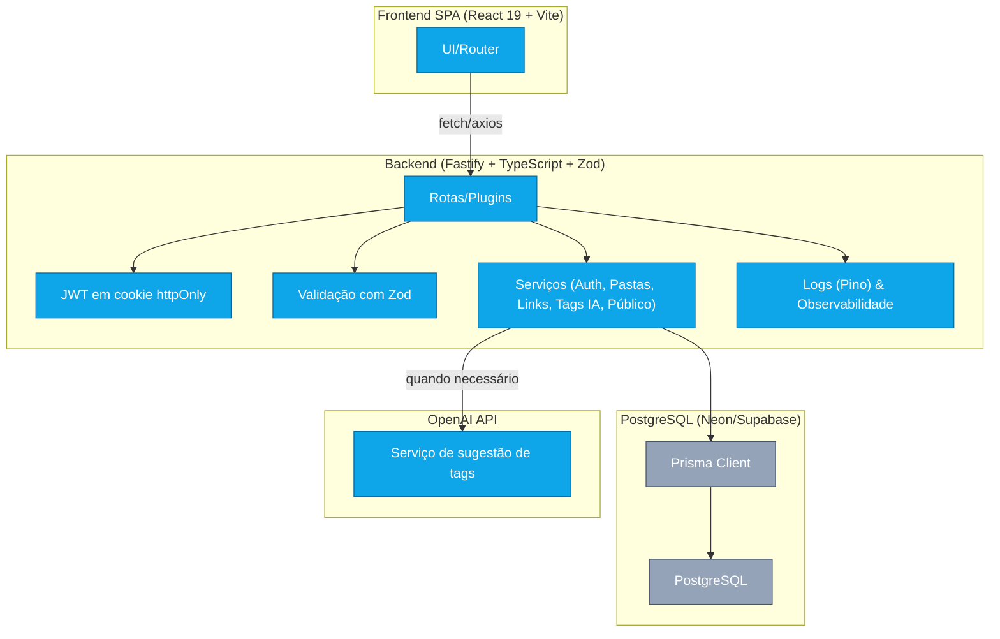

## Arquitetura — Visão de Alto Nível

Diagrama atualizado com os principais componentes do Notia e seus fluxos.

- Autenticação: JWT assinado em cookie httpOnly; CORS restrito ao domínio do frontend.
- Validação: Zod provê schemas para requests/responses, integrados ao Fastify.
- Persistência: Prisma como ORM type-safe para PostgreSQL gerenciado (Neon/Supabase).
- IA: Serviço externo da OpenAI para sugerir tags; com timeout e fallback.
- Observabilidade: logs estruturados (Pino) e métricas básicas de latência.

