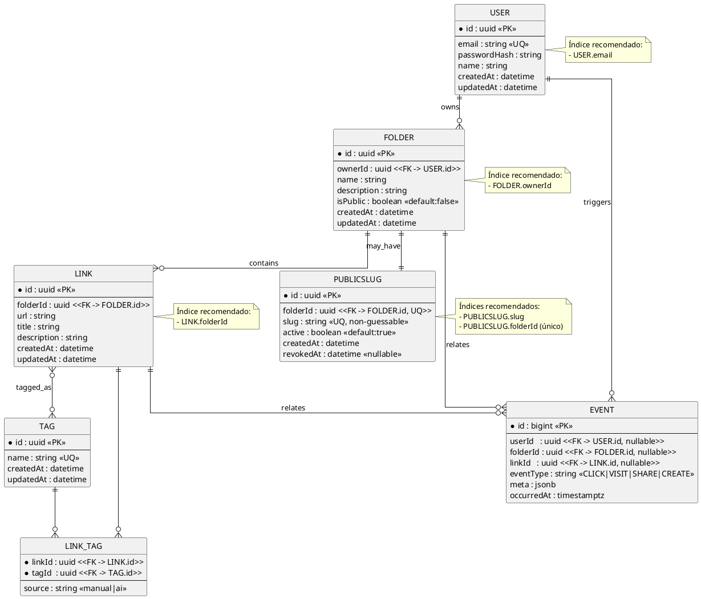

## DER — Modelo de Dados Principal

Observações:
- `PUBLICSLUG.folderId` é único (uma pasta tem no máx. um slug ativo por vez).
- `LINK_TAG.source` indica se a tag foi sugerida pela IA ou definida manualmente.
- Índices recomendados: `User.email`, `Folder.ownerId`, `Link.folderId`, `PublicSlug.slug`.

