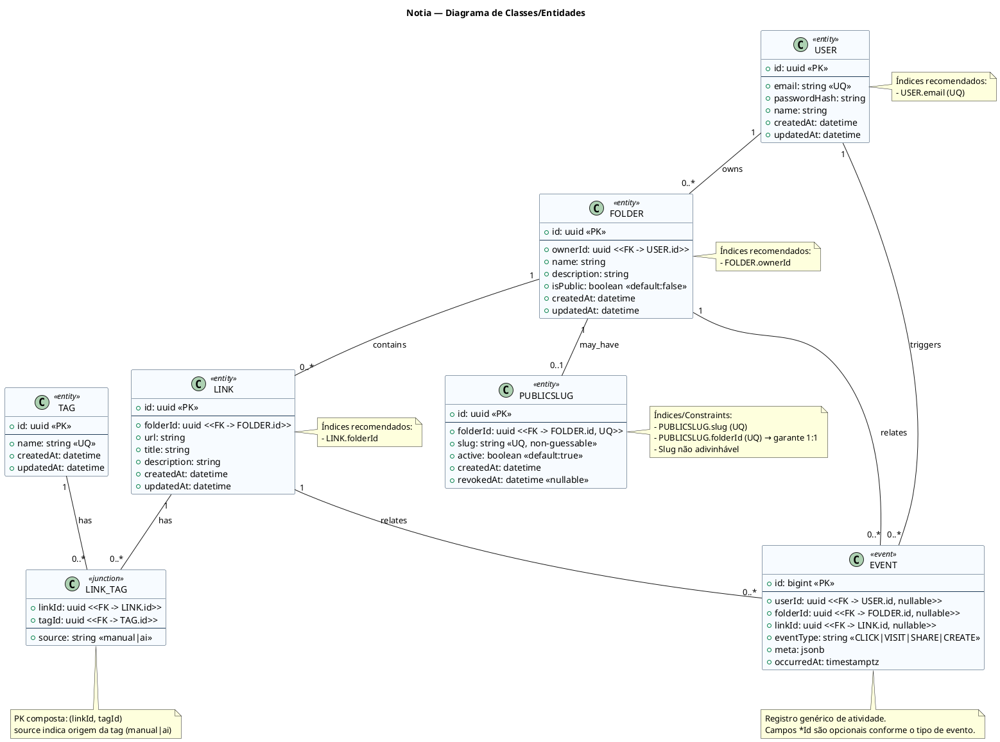

# Diagrama de Classes/Entidades — Notia (PlantUML)

> Modelo de classes equivalente ao DER enviado, com estereótipos e notas de índices/constraints.

```plantuml
@startuml
title Notia — Diagrama de Classes/Entidades

skinparam monochrome false
skinparam class {
  BackgroundColor #f7fbff
  BorderColor #1f3b57
}
hide methods

' ===================== CLASSES / ENTIDADES =====================
class USER <<entity>> {
  + id: uuid <<PK>>
  --
  + email: string <<UQ>>
  + passwordHash: string
  + name: string
  + createdAt: datetime
  + updatedAt: datetime
}

class FOLDER <<entity>> {
  + id: uuid <<PK>>
  --
  + ownerId: uuid <<FK -> USER.id>>
  + name: string
  + description: string
  + isPublic: boolean <<default:false>>
  + createdAt: datetime
  + updatedAt: datetime
}

class LINK <<entity>> {
  + id: uuid <<PK>>
  --
  + folderId: uuid <<FK -> FOLDER.id>>
  + url: string
  + title: string
  + description: string
  + createdAt: datetime
  + updatedAt: datetime
}

class TAG <<entity>> {
  + id: uuid <<PK>>
  --
  + name: string <<UQ>>
  + createdAt: datetime
  + updatedAt: datetime
}

class LINK_TAG <<junction>> {
  + linkId: uuid <<FK -> LINK.id>>
  + tagId: uuid <<FK -> TAG.id>>
  --
  + source: string <<manual|ai>>
  ' PK composta: (linkId, tagId)
}

class PUBLICSLUG <<entity>> {
  + id: uuid <<PK>>
  --
  + folderId: uuid <<FK -> FOLDER.id, UQ>>
  + slug: string <<UQ, non-guessable>>
  + active: boolean <<default:true>>
  + createdAt: datetime
  + revokedAt: datetime <<nullable>>
}

class EVENT <<event>> {
  + id: bigint <<PK>>
  --
  + userId: uuid <<FK -> USER.id, nullable>>
  + folderId: uuid <<FK -> FOLDER.id, nullable>>
  + linkId: uuid <<FK -> LINK.id, nullable>>
  + eventType: string <<CLICK|VISIT|SHARE|CREATE>>
  + meta: jsonb
  + occurredAt: timestamptz
}

' ===================== RELACIONAMENTOS =====================
USER "1" -- "0..*" FOLDER : owns
FOLDER "1" -- "0..*" LINK : contains

' N..M via tabela de junção
LINK "1" -- "0..*" LINK_TAG : has
TAG  "1" -- "0..*" LINK_TAG : has

' 1:1 (no máximo um slug ativo por pasta)
FOLDER "1" -- "0..1" PUBLICSLUG : may_have

USER "1" -- "0..*" EVENT : triggers
FOLDER "1" -- "0..*" EVENT : relates
LINK "1" -- "0..*" EVENT : relates

' ===================== NOTAS / ÍNDICES =====================
note right of USER
Índices recomendados:
- USER.email (UQ)
end note

note right of FOLDER
Índices recomendados:
- FOLDER.ownerId
end note

note right of LINK
Índices recomendados:
- LINK.folderId
end note

note right of PUBLICSLUG
Índices/Constraints:
- PUBLICSLUG.slug (UQ)
- PUBLICSLUG.folderId (UQ) → garante 1:1
- Slug não adivinhável
end note

note bottom of LINK_TAG
PK composta: (linkId, tagId)
source indica origem da tag (manual|ai)
end note

note bottom of EVENT
Registro genérico de atividade.
Campos *Id são opcionais conforme o tipo de evento.
end note

@enduml
```
