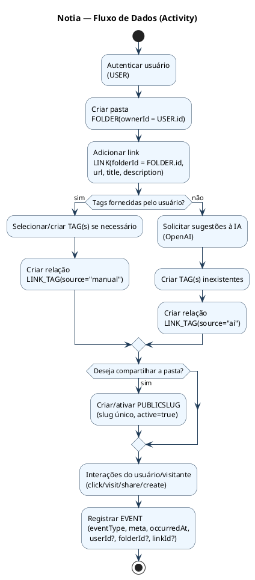
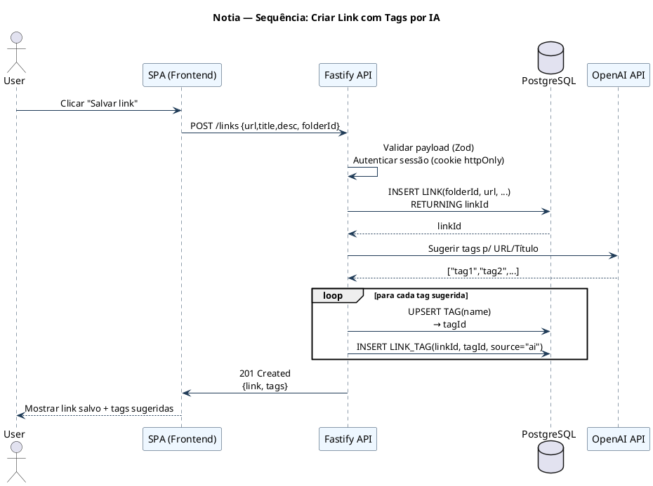
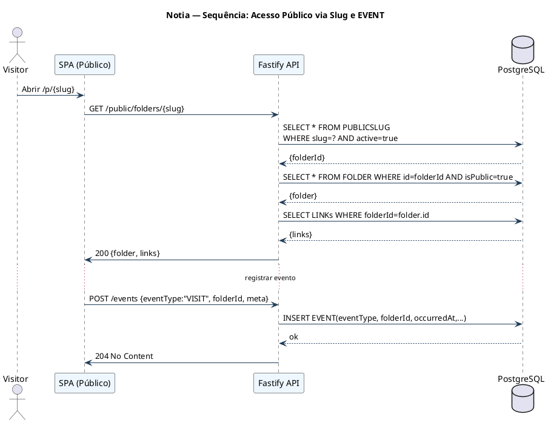

# Diagramas de Fluxo e Sequência — Notia

## 1) Fluxo de Dados (Activity)

```plantuml
@startuml
title Notia — Fluxo de Dados (Activity)
skinparam monochrome false
skinparam activity {
  BackgroundColor #eef7ff
  ArrowColor #1f3b57
  BorderColor #1f3b57
}

start

:Autenticar usuário\n(USER);
:Criar pasta\nFOLDER(ownerId = USER.id);

:Adicionar link\nLINK(folderId = FOLDER.id,\nurl, title, description);

if (Tags fornecidas pelo usuário?) then (sim)
  :Selecionar/criar TAG(s) se necessário;
  :Criar relação\nLINK_TAG(source="manual");
else (não)
  :Solicitar sugestões à IA\n(OpenAI);
  :Criar TAG(s) inexistentes;
  :Criar relação\nLINK_TAG(source="ai");
endif

if (Deseja compartilhar a pasta?) then (sim)
  :Criar/ativar PUBLICSLUG\n(slug único, active=true);
endif

:Interações do usuário/visitante\n(click/visit/share/create);
:Registrar EVENT\n(eventType, meta, occurredAt,\n userId?, folderId?, linkId?);

stop
@enduml
```

---

## 2) Sequência: Criar Link com Tags por IA

```plantuml
@startuml
title Notia — Sequência: Criar Link com Tags por IA
skinparam sequenceMessageAlign center
skinparam sequence {
  ArrowColor #1f3b57
  LifeLineBorderColor #1f3b57
  ParticipantBorderColor #1f3b57
  ParticipantBackgroundColor #eef7ff
}

actor User
participant SPA as "SPA (Frontend)"
participant API as "Fastify API"
database DB as "PostgreSQL"
participant OpenAI as "OpenAI API"

User -> SPA : Clicar "Salvar link"
SPA -> API : POST /links {url,title,desc, folderId}
API -> API : Validar payload (Zod)\nAutenticar sessão (cookie httpOnly)
API -> DB : INSERT LINK(folderId, url, ...)\nRETURNING linkId
DB --> API : linkId

API -> OpenAI : Sugerir tags p/ URL/Título
OpenAI --> API : ["tag1","tag2",...]

loop para cada tag sugerida
  API -> DB : UPSERT TAG(name)\n→ tagId
  API -> DB : INSERT LINK_TAG(linkId, tagId, source="ai")
end

API -> SPA : 201 Created\n{link, tags}
SPA --> User : Mostrar link salvo + tags sugeridas
@enduml
```

---

## 3) Sequência: Acesso Público via Slug e EVENT

```plantuml
@startuml
title Notia — Sequência: Acesso Público via Slug e EVENT
skinparam sequence {
  ArrowColor #1f3b57
  ParticipantBackgroundColor #eef7ff
}

actor Visitor
participant SPA as "SPA (Público)"
participant API as "Fastify API"
database DB as "PostgreSQL"

Visitor -> SPA : Abrir /p/{slug}
SPA -> API : GET /public/folders/{slug}
API -> DB : SELECT * FROM PUBLICSLUG\nWHERE slug=? AND active=true
DB --> API : {folderId}
API -> DB : SELECT * FROM FOLDER WHERE id=folderId AND isPublic=true
DB --> API : {folder}
API -> DB : SELECT LINKs WHERE folderId=folder.id
DB --> API : {links}
API -> SPA : 200 {folder, links}

... registrar evento ...
SPA -> API : POST /events {eventType:"VISIT", folderId, meta}
API -> DB : INSERT EVENT(eventType, folderId, occurredAt,...)
DB --> API : ok
API -> SPA : 204 No Content

@enduml
```
